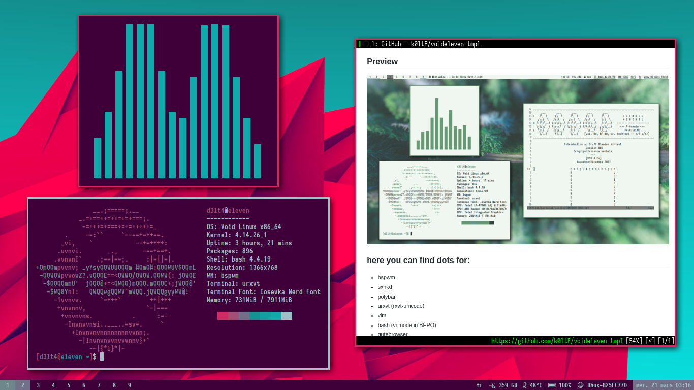

# koltrast's Voideleven dotfiles

Here you can find my dotfiles. These are personal but you can probably find things that may interest you. Everything here works or intends to works with the [BÉPO](https://bepo.fr) keyboard layout. A french ergonomic (Dvorak way) keyboard layout.

The rice is not finished, and some stuff could probably work in a better way
… but I'm still learning. 

## Preview

*This is how it actually not looks like*

## here you can find dots for:

+ bspwm
+ sxhkd
+ urxvt (rxvt-unicode)
+ neovim
+ bash (vi mode in BÉPO)
+ qutebrowser
+ ranger
+ mutt / msmtp / offlineimap
+ newsboat
+ calcurse
+ zathura
+ mpd & ncmpcpp
+ mpv 
+ redshift
+ compton
+ dunst
+ neofetch
+ some scripts
+ few fonts that I use

And more to come!

## Programs that I Use

qutebrowser, Blender, qBittorent, compton, pywal, mpv,
zathura, feh, dmenu, arandr, ranger, neomutt, newsboat, calcurse,
ncmpcpp, mpd, htop, weechat, homeshick, lxappearance, dunst,
notify-send, pass…
