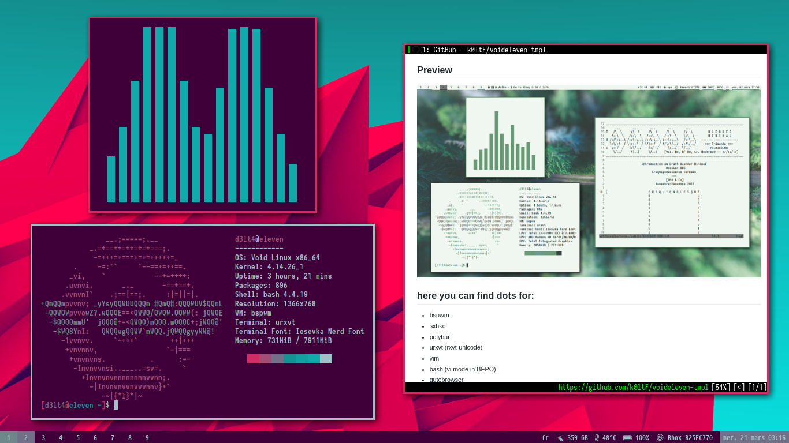

# k0ltF's Voideleven templates

Here are my dotfiles, as templates. The purpose of this repository is mostly
to share my config and also to have a last backup in case of emergency.

Everything here works or intends to works with the [BÉPO](https://bepo.fr)
keyboard layout. A french ergonomic (Dvorak way) keyboard layout.

The rice is not finished, and some stuff could probably work in a better way
… but I'm still learning. 

## Preview

## here you can find dots for:

+ bspwm
+ sxhkd
+ polybar
+ urxvt (rxvt-unicode)
+ vim
+ bash (vi mode in BÉPO)
+ qutebrowser
+ ranger
+ mutt / msmtp / offlineimap
+ newsboat
+ calcurse
+ zathura
+ mpd & ncmpcpp
+ mpv 
+ redshift
+ compton
+ neofetch
+ some scripts
+ few fonts that I use (only the free ones)

You can find i3 that I don't use anymore in my
[legacy-dotfiles](https://github.com/k0ltF).

And more to come!

## Programs that I Use

qutebrowser, GIMP, Blender, qBittorent, NetworkManager, compton, pywal, mpv,
zathura, feh, dmenu, passmenu, arandr, ranger, neomutt, newsboat, calcurse,
ncmpcpp, mpd, htop, weechat, homeshick, lxappearance

## Credits

Many scripts that I use came from [Luke Smith](https://github.com/LukeSmithxyz)
from whose I learn a lot. There also few things from [fs0ciety](http://code.fs0ciety.info)
[offline!].
